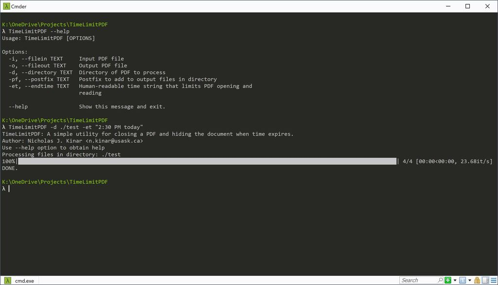
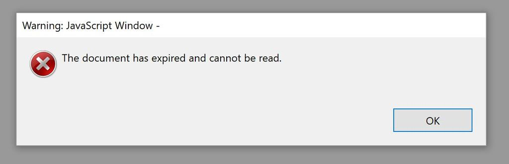

# TimeLimitPDF

A simple utility for editing a PDF so that the PDF automatically is not
usable when a set time expires.
The security offered by this utility is sufficient for some scenarios,
but is not intended to be comprehensive.  A human-readable time can be used
to set the timeout (i.e. "today at 2:30 PM").  The PDF can be sent to another
person by e-mail and a separate program or plugin is not required to be installed
on each computer.






## Motivation

Academic assessment situations often involve exams that are time limited.  For use in a lab or exam,
PDF documents are required to be closed at a given time.  This software package can be
used to set a date and time when the PDF file should not be opened.  The PDF file will automatically
close after the set date and time.  Successive PDF document open events will show a dialog box
indicating that the document is not to be opened.

For the technically-inclined, it is not difficult to re-open the PDF file after the set timeout.  The code provides details.
However, this software is expected to be useful in some situations.


## Getting Started
Ensure that Python3 is installed.  The `cx_Freeze` utility is used to build an executable
that can be installed on a number of systems (Windows, Linux, OS X).

```
pip install PyMuPDF dateparser chevron fitz click tqdm cx_Freeze
```

### Assumptions

* The document is used in a controlled environment where Javascript is enabled in the PDF reader.
* The reader is similar to Adobe Acrobat and the reader supports the Adobe Javascript API.
* The PDF reader supports OCGs and layers.
* The source PDF is not encrypted. (A password can be added after this program
  has been used.)

### Example Usage

The PDF documents generated by this program will automatically close
and cannot be opened after the set timeout.

```
TimeLimitPDF --help
```

```
TimeLimitPDF -d ./test -et "2:30 PM today"
```

```
TimeLimitPDF -d ./test -et "2:30 PM today" -pf "_limited"
```

```
TimeLimitPDF -i in.pdf -o out.pdf -et "2:30 PM today"
```

```
λ TimeLimitPDF --help
Usage: TimeLimitPDF [OPTIONS]

Options:
  -i, --filein TEXT     Input PDF file
  -o, --fileout TEXT    Output PDF file
  -d, --directory TEXT  Directory of PDF to process
  -pf, --postfix TEXT   Postfix to add to output files in directory
  -et, --endtime TEXT   Human-readable time string that limits PDF opening and
                        reading

  --help                Show this message and exit.
```


### Documentation

This readme file and utility should be easily understandable. Please feel free to contact me
if you would like binaries or other changes made to the code.


## Authors

* **Nicholas J. Kinar <n.kinar@usask.ca>**

## Acknowledgments

Developed after a delightful conversation with my good friend Reza Bahremand
(https://twitter.com/AbdolrezaBahrem) where we both wondered if a PDF file
can be edited to automatically "time out."  Since we both work in academia,
this utility might be useful in a number of different circumstances.

## Visual Meditation


